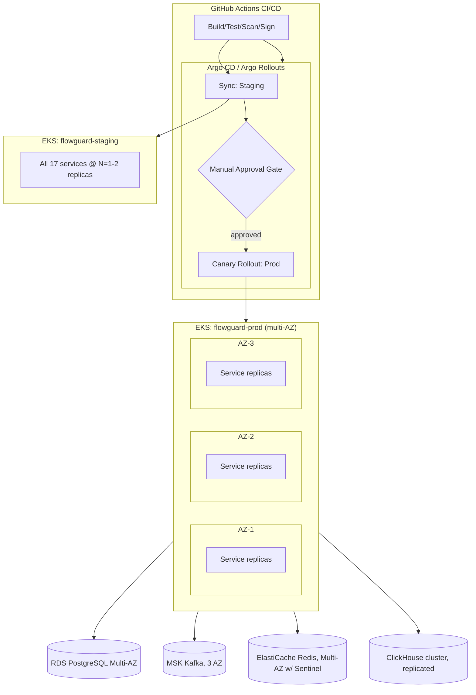
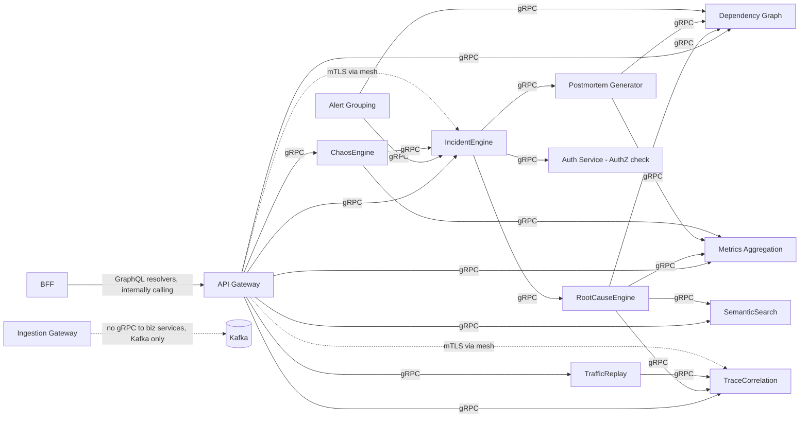
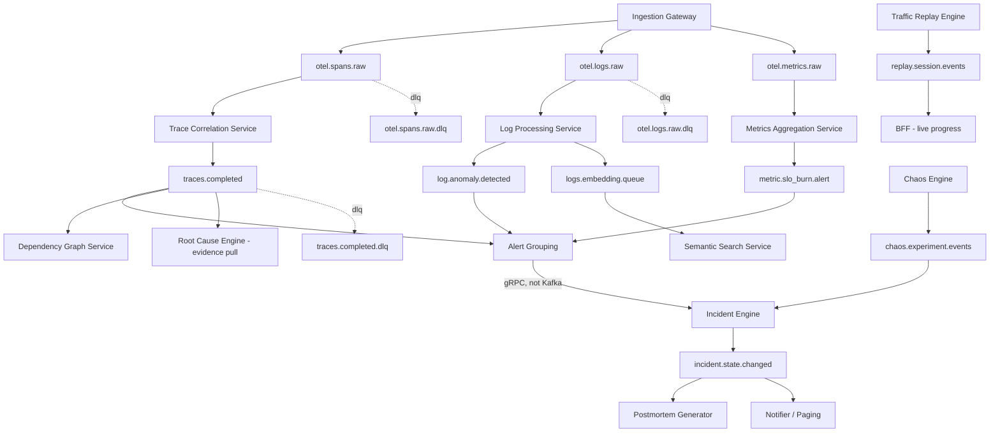
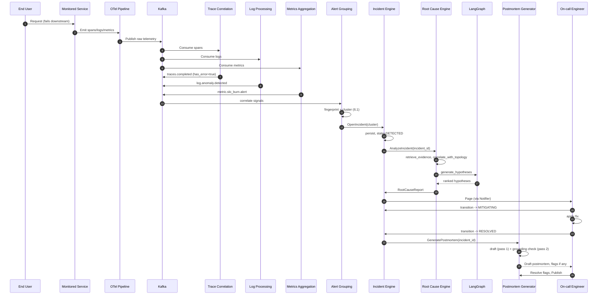

# FlowGuard Diagrams

This document consolidates the key architecture diagrams for FlowGuard.

## Full Deployment Topology

## gRPC Service Communication

## Kafka Message Flow Map

## Master Request Lifecycle — Full Sequence

